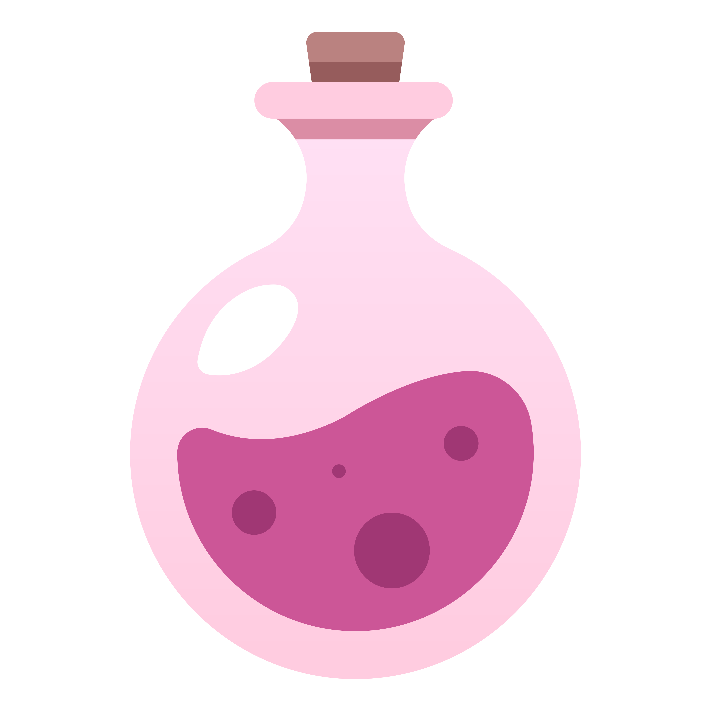
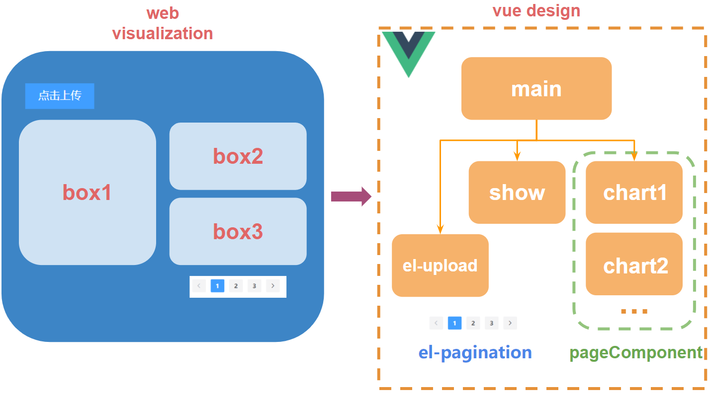
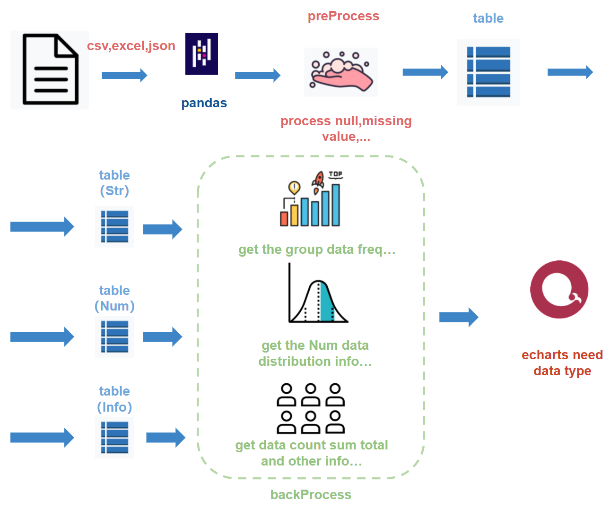

<h2  align="center">Auto Kaggle DataSets Visualization Project</h2>

自动处理可视化kaggle竞赛数据集

</a>

</a>

 

###### 实现工具：

- vue（前端）
- echarts（图表）
- flask（后端）

 可视化展示如下

## idea：

###### 为什么会想到做这么一个期末答辩的项目呢？

在期中的可视化项目中制作了一个疫情大屏的展示图，当时通过爬虫和flask以及pyecharts进行开发，最终实现了如下的实时疫情效果展示大屏，但是，当时的项目有还是有很大的局限性，也就是说我是针对具体的某个数据对其进行处理的，当爬虫网页的api一进行更换那么我的前端可视化就会直接崩溃。

因此就出现了一个想法是否可以通过只要你给我数据那么我就可以自动的将你的数据可视化出来。于是乎我就想到先针对小范围的数据进行自动化可视化，然后在将来再扩展到任意的数据集上。

为了将来的扩展性，我们必须要设计好整个流程的框架

## Pipeline：

pipeline总共分为两个部分前端部分和后端数据处理部分

##### 前端的设计：

前端通过采用vue来进行设计，利用vue的树形结构在将来我们会有很好的扩展性，可以在叶节点中不断扩充新的可视化图表，也利于我们留下接口实现新的功能。

通过设计3个box来实现最终的前端界面的展示，再通过分页来将绘制的图标一一呈现出来，

###### main

对应着整个前端界面的body部分，对组件chart*进行跳转动画操作。界面初始话，分页操作，存储当前界面信息。

###### show

对应前端界面的box1部分是main对象的一个属性，存储的是在前端中显示的chart

###### pageComponent

为main对象的属性，数组类型，用来存储绘制的chart图表

###### el-pagination

为vue组件，用来实现分页功能。

##### 后端的数据的处理：

对于数据的来源，目前先针对小部分领域的数据集，因此目前只针对kaggle官方网站的数据来进行可视化，针对数据集来源是模型训练类型数据

为了能够自动化的通过给定的表格生成图形，我们必须需要通过对数据进行处理

数据处理主要分成三部分数据读取，数据前处理，数据后处理

##### 数据读取

支持pandas可读取的所有类型，例如excel，csv，json等

只需在读取数据前对给定的数据的后缀进行判断即可

##### 数据前处理

需要处理数据的空值，缺失值等为默认值，防止在后面的画图过程或者返回数据的过程导致程序报错，同时统计存储这些缺失值和空值信息。

##### 数据后处理

因为目前数据的格式无非就是字符串类型(object)或者数值类型(int64,float64,int32,float32)，当然还有时间等类型数据，但是由于目前pandas读取数据时并不能自动的将时间类型数据转化成时间类型而是转化成字符串类型(object),

因此将数据分成3种块进行处理

###### Str type

可以将字符串类型数据进行分组group，因为字符串类型数据，并不能很好的直接在坐标轴上体现展示，

分组后我们就可以得到各个列出现的频率，就可以得到频率最高的数据并将其占比可视化出来

原数据形式：

| column0 |
| :-----: |
|  data0  |
|  data0  |
|  data1  |
|  data2  |
|   ...   |

转化如下：

| top  | column0 | group |
| :--: | :-----: | :---: |
|  1   |  data0  |  50   |
|  2   |  data1  |  30   |
|  3   |  data2  |  20   |

###### Num type

数值类型的数据可以进行很多的处理方式，

例如

- 可以统计数值型每条数据的频率绘制数值型数据的分布示意图转化和str type类似。

- 取出3列数据绘制3d图型
- 统计数据的均值，中位数，上4分位点，下4分位点绘制箱型图
- 将得到的数值性数据绘制平行图

###### Info type

统计数据的信息，列如各列空值，总数，绘制饼图进行展示

## bug fix log

- 自定义实现的的vue的js文件需要放在html\<body\>标签的后面否则无法读取列如本文中的script.js必须放在body后面

- flask使用vue有无法重定向bug目前没有找到很好的解决方案
