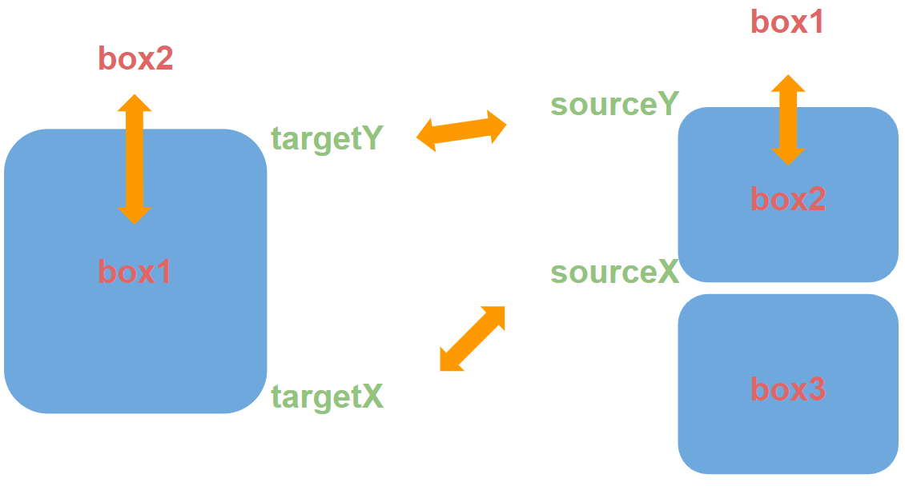
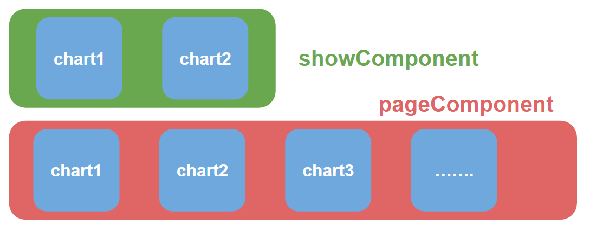
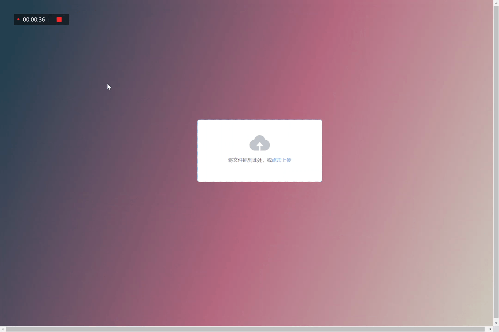

<div align=center>

</div>
<h2  align="center">Auto Kaggle DataSets Visualization Project</h2>
<p  align="center">自动处理可视化kaggle竞赛数据集</p>
<div  align="center">
<a href="https://github.com/yaocctao/kaggle-DataVisulization">
</a>
<a href="https://cn.vuejs.org/index.html"></a>
<a href="https://flask.palletsprojects.com/en/2.0.x/"></a>
<a href="https://element.eleme.cn/"></a>
<a href="https://echarts.apache.org/zh/index.html"></a>
</a>
<a href="https://github.com/yaocctao/kaggle-DataVisulization"></a>
</a>
<a href="https://github.com/yaocctao/kaggle-DataVisulization/pulls"></a>
<a href="https://github.com/yaocctao/kaggle-DataVisulization/issues"></a>
<br></div>

## 实现工具：

- vue（前端）
- element（前端vue工具包）
- echarts（图表）
- flask（后端）

 可视化展示如下

## Idea：

##### 为什么会想到做这么一个期末答辩的项目呢？

在期中的可视化项目中制作了一个疫情大屏的展示图，当时通过爬虫和flask以及pyecharts进行开发，最终实现了如下的实时疫情效果展示大屏，但是，当时的项目有还是有很大的局限性，也就是说我是针对具体的某个数据对其进行处理的，当爬虫网页的api一进行更换那么我的前端可视化就会直接崩溃。


因此就出现了一个想法是否可以通过只要你给我数据那么我就可以自动的将你的数据可视化出来。于是乎我就想到先针对小范围的数据进行自动化可视化，然后在将来再扩展到任意的数据集上。

为了将来的扩展性，我们必须要设计好整个流程的框架

## Pipeline：

pipeline总共分为两个部分前端部分和后端数据处理部分

##### 前端的设计：

前端通过采用vue来进行设计，利用vue的树形结构在将来我们会有很好的扩展性，可以在叶节点中不断扩充新的可视化图表，也利于我们留下接口实现新的功能。


通过设计3个box来实现最终的前端界面的展示，再通过分页来将绘制的图标一一呈现出来，

###### main

对应着整个前端界面的body部分，对组件chart*进行跳转动画操作。界面初始话，分页操作，存储当前界面信息。

###### show

对应前端界面的box1部分是main对象的一个属性，存储的是在前端中显示的chart

###### pageComponent

为main对象的属性，数组类型，用来存储绘制的chart图表

###### el-pagination

为vue组件，用来实现分页功能。

##### 后端的数据的处理：

对于数据的来源，目前先针对小部分领域的数据集，因此目前只针对kaggle官方网站的数据来进行可视化，针对数据集来源是模型训练类型数据


为了能够自动化的通过给定的表格生成图形，我们必须需要通过对数据进行处理

数据处理主要分成三部分数据读取，数据前处理，数据后处理

##### 数据读取

支持pandas可读取的所有类型，例如excel，csv，json等

只需在读取数据前对给定的数据的后缀进行判断即可

##### 数据前处理

需要处理数据的空值，缺失值等为默认值，防止在后面的画图过程或者返回数据的过程导致程序报错，同时统计存储这些缺失值和空值信息。

##### 数据后处理

因为目前数据的格式无非就是字符串类型(object)或者数值类型(int64,float64,int32,float32)，当然还有时间等类型数据，但是由于目前pandas读取数据时并不能自动的将时间类型数据转化成时间类型而是转化成字符串类型(object),

因此将数据分成3种块进行处理

###### Str type

可以将字符串类型数据进行分组group，因为字符串类型数据，并不能很好的直接在坐标轴上体现展示，

分组后我们就可以得到各个列出现的频率，就可以得到频率最高的数据并将其占比可视化出来

原数据形式：

| column0 |
| :-----: |
|  data0  |
|  data0  |
|  data1  |
|  data2  |
|   ...   |

转化如下：

| top  | column0 | group |
| :--: | :-----: | :---: |
|  1   |  data0  |  50   |
|  2   |  data1  |  30   |
|  3   |  data2  |  20   |

###### Num type

数值类型的数据可以进行很多的处理方式，

例如

- 可以统计数值型每条数据的频率绘制数值型数据的分布示意图转化和str type类似。

- 取出3列数据绘制3d图型
- 统计数据的均值，中位数，上4分位点，下4分位点绘制箱型图
- 将得到的数值性数据绘制平行图

###### Info type

统计数据的信息，列如各列空值，总数，绘制饼图进行展示

## Animate

动画效果的实现通过jQuery的animate方法实现



实现方法很简单，通过点击对应的子组件的box会触发一个emit给父组件main，父组件在接受到这个事件后会执行将父组件中的show属性中存储的主视图的box取出，然后和发出信息的子组件进行对调，首先是对调它们的class也就是样式box的大小，然后通过animate实现位置的动画移动

## Pagination

采用Element组件实现，一套为开发者、设计师和产品经理准备的基于 Vue 2.0 的桌面端组件库



当点击前一页后一页或某一页时会触发一个handleCurrentChange自定义函数并且将当前页作为改函数的参数，handleCurrentChange函数的实现是通过遍历父组件main存储的showComponent属性中的所有chart进行隐藏，然后根据当前页找到对应的需要显示的chart

**注意**：由于点击动画的事件会更改pageComponent列表中的chart，因此我们需要在进行主视图和侧边栏切换时通过而外的操作来更新pageComponent列表内容和showComponent内容。

## Upload File


实现文件的upload上传更新图表

通过element的el-upload标签来实现

```js
    <el-upload
            ref="upload"
            class="upload-demo"
            action="http://127.0.0.1:5000/upload"
            :on-success="handleAvatarSuccess">
        <el-button size="small" type="primary">点击上传</el-button>
        <div slot="tip" class="el-upload__tip" style="position:absolute;top:1%; left: 5%; color:white">只能上传csv/xlsx文件</div>
    </el-upload>
```

action为指定的接受文件的地址，当文件上传后会发送一个post请求，后端接受到文件后会将文件进行保存，同时跳转界面到主界面展示绘制的图表

❗❗❗这里我遇到一个应该是flask和vue的冲突导致的，flask无法重定向到主界面，然后我通过el-upload标签中的on-success方法当文件上传成功后我会调用on-success方法跳转到主界面展示图表

## Loading



通过服务的方式在图表还未绘制出来呈现loading

```js
this.loading = this.$loading({
          lock: true,
          text: 'Loading',
          spinner: 'el-icon-loading',
          background: 'rgba(0, 0, 0, 0.7)'
        });
.....
绘制图表
.....
绘制完毕
this.$loading.close()
```

在绘制图表前初始话main组件的\$loading属性就会在前端出现loading画面，当图表绘制完毕后将\$loading.close()关闭loading

整个loading过程就实现了

## Ajax

为实现数据的异步请求，提高用户的体验效果，通过采用ajax对数据进行异步请求，实现绘制一张图就呈现一张图，无需等待至全部图表都绘制才呈现

将绘制的每个图表异步进行，将先绘制好的图表存储在对应的pageComponent中main父组件会定时的查看pageComponent中的图表在满足最低的呈现3个图表的要求后立即将图表呈现到前端，同时将pageComponent的length作为图表总数绑定到el-pagination标签中的total变量中实时更新页数。实现异步处理数据

## Run

使用教程：

开箱即用

pip安装好需要的环境包后

- flask
- pandas
- numpy
- xlrd

直接python main.py运行

## 快速添加自定义图例

项目路径介绍

- processData
  - files (上传文件存储的路径)
  - testData(用来测试的数据)
  - DataVisualization.py(用于数据处理)
- src
  - README.md依赖图片
- static
  - css
    - fonts(element 工具字体)
    - index.css(element css)
    - style.css(自定义 css code)
  - js
    - axios.min.js(vue ajax请求)
    - echarts.min.js(echarts 绘图)
    - echarts-gl.min.js(echarts 3D图)
    - index.js(element工具包js)
    - jquery.min.js
    - purple-passion.js(echarts 主题)
    - script.js(vue 实现code)
    - vue.js(vue js)
  - logo.svg
- templates
  - index.html(图表gallery)
  - main.html(上传文件界面)
- main.py(flask后端请求url)
- README.md

了解了工程路径后我们来看一下如何添加自定义的图表

以添加chart7图表为例

#### step1

在script中添加新的图表标签chart7()

```js
//chart7为你定义的图表的标签名字
Vue.component('chart7', {
    template: "<div v-bind:class='classObject'  v-bind:style='{display:show}' :id='\"chart\"+idPlot'>{{msg}}<div :id='idPlot'></div></div>",
    props: {
        getPlot: {type: Function},
        url: {type: String},
        idPlot: {type: String},
        msg: {type: String}
    },
    data: function () {
        return {
            classObject: {
                box1: false,
                box2: true,
                box3: false
            },
            index: null,
            show: 'none',
        }
    },
    methods: {
        chart: function (id = '7', dataInit) {
            var chartDom = document.getElementById(id);
            chartDom.style.width = '100%';
            chartDom.style.height = '90%';

            if (dataInit !== false) {
                this.myChart = echarts.init(chartDom, 'purple-passion');
				//你绘制的图表内容
				//------------------------
				//你绘制的echarts的代码内容
				
				//------------------------
                this.myChart.setOption(option);

                var that = this
                this.index = this.$parent.pageComponent.length
                if ((this.index + 1) % 2 === 0) {
                    this.classObject.box1 = false;
                    this.classObject.box2 = false;
                    this.classObject.box3 = true;
                } else {
                    this.classObject.box1 = false;
                    this.classObject.box2 = true;
                    this.classObject.box3 = false;
                }
                this.$parent.pageComponent.push(this)
                this.myChart.getZr().on('click', function (params) {
                    that.$emit('trans', that);
                });
            }

        }
    },
    mounted: function () {
        this.getPlot(this.url, this.idPlot, this.chart)
    }
})
```

#### step2

在index.html中添加\<chart7\>标签

```js
//接口说明@trans为动画效果实现的函数，ip-plot为对应图表的dom id需具有唯一性，url为数据获取的请求连接，msg为前端显示的图表title
<chart7 @trans="transform" id-plot="7" :get-plot="getPlot" url="http://127.0.0.1:5000/line" msg="key键不同列数据展示">
</chart7>
```

#### step3

在DataVisualization.py中

```python
class Pipeline():
    def __init__(self, path):
        self.data = self.read_data(path)
        self.dataInfo = self.get_data_info()
        self.dataCount_NanCount = [int(self.data.count().max()), int(self.data.isna().sum().max())]
        # deal the missing value to str 'null'
        self.data = self.data.fillna(value='null')
    #............
    #............
    #............
    #添加获取数据的实现方法
	def get_line(self) -> Union[Dict, None]:
        try:
            dataDict = {}
            data = self.data
            unique = self.data.nunique()
            xDataColumn = unique[unique == self.dataCount_NanCount[0]].index[0]
            xData =[float(d) for d in  data[xDataColumn].to_list()]
            data = data.drop(xDataColumn, axis=1)
            numData = data.select_dtypes(include=["int64", "int32", "float32", "float"])
            columnsNames = numData.columns.to_list()
            numData = numData.T.to_numpy()
            dataList = []
            for row in numData:
                rows = []
                for cell in row:
                    rows.append(float(cell))
                dataList.append(rows)
            dataDict['columns'] = columnsNames
            dataDict['xName'] = xDataColumn
            dataDict['data'] = dataList
            dataDict['xData'] = xData
        except:
            return None
        if dataDict == {}:
            return None
        return dataDict
```

在main.py中

```python
@app.route('/line')
def line():
    result = pipeline.get_line()
    if result == None:
        return 'false'
    else:
        #必须要有jsonify处理返回的数据为json否则前端收不到数据会报错
        return jsonify(result)
```

添加数据获取的请求链接

## Docker 一键式快速部署

修改项目中的`url`
###### 在main.pyt中
```python
    app.run(debug=True,host='<your url>',port='<your port 默认5000>')
```
###### 在main.html中

```js
    <el-upload
            class="upload-demo"
            drag
            {#            修改成自己的url地址#}
            action="<your url>/upload"
            multiple style="position:absolute;bottom: 40%;left: 40%"
            :on-success="handleAvatarSuccess">
        <i class="el-icon-upload"></i>
        <div class="el-upload__text">将文件拖到此处，或<em>点击上传</em></div>
        <div slot="tip" class="el-upload__tip" style="position:absolute;top:1%; left: 5%; color:white">只能上传csv/xlsx文件</div>
    </el-upload>
```

###### 在script中

```js
....... 
methods: {
handleAvatarSuccess(){
window.location.href="<your url>";
},
.......
```

###### 在index.html中

```js
<chart1 @trans="transform" id-plot="1" :get-plot="getPlot" url=<your url>/frequency"
            msg="各列top1数据占比(字符串类型)">
    </chart1>

    <chart2 @trans="transform" id-plot="2" :get-plot="getPlot" url="<your url>/distribute" msg="数据分布">
    </chart2>

    <chart3 @trans="transform" id-plot="3" :get-plot="getPlot" url="<your url>/dataset_3d_chart"
            msg="数据集3d分布展示">
    </chart3>

    <chart4 @trans="transform" id-plot="4" :get-plot="getPlot" url="<your url>/info" msg="数据信息展示">
    </chart4>

    <chart5 @trans="transform" id-plot="5" :get-plot="getPlot" url="<your url>/boxplot" msg="数据各列箱型图展示">
    </chart5>

    <chart6 @trans="transform" id-plot="6" :get-plot="getPlot" url="<your url>/parallelPlot" msg="平行图数据展示">
    </chart6>

    <chart7 @trans="transform" id-plot="7" :get-plot="getPlot" url="<your url>/line" msg="key键不同列数据展示">
    </chart7>
```

需要修改

`docker run -itd -p <主机端口>:<ssh端口默认22> -p <主机端口>:<flask默认端口5000> -v <主机项目路径>:<容器挂载路径> -w <工作路径，需和挂载路径一致> --name <容器名字>  <镜像名> python main.py`
其中镜像要求python 3.7 并且满足上述的项目运行环境
例如：

`docker run -itd -p 122:22 -p 8787:8787 -v /home/yaocctao/kaggle-DataVisulization:/dataVisualization -w /dataVisualization --name visualization  222.198.0.4:5000/data_visualization python main.py`

## Bug Fix Log

- flask与vue.js的语法冲突，解决方法：修改flask前端变量语法{{}}为[[]]
- vue显示echarts问题，通过将方法在mount中调用实现，原因是需要vue先creat对应的echarts画图的dom后才可以
- 实现主示图和侧边栏的转换，通过父组件存储主视图的dom信息在切换时就可以定位到主视图的dom进行切换
- 分页显示问题，通过vue组件show变量绑定dom的display实现是否展示
- ajax异步问题导致父组件在初始话时无法显示图表，解决方法通过定时查看生成的图表数满足最低的显示条件后显示
- new Vue对象必须在vue component前的顺序问题
- 子组件函数冗余，通过emit触发父组件函数进行子组件的切换
- 最新echarts版本与echarts-gl版本不兼容问题，导致3d图绘制报错，解决方法修改echarts版本为v5.1.2
- 获取数据url写死问题，通过添加子组件url属性，通过变量输入获取数据请求地址

- 自定义实现的的vue的js文件需要放在html\<body\>标签的后面否则无法读取列如本文中的script.js必须放在body后面

- flask使用vue有无法重定向bug目前没有找到很好的解决方案，通过父组件查看是否存在某个子组件解决(临时方案)
